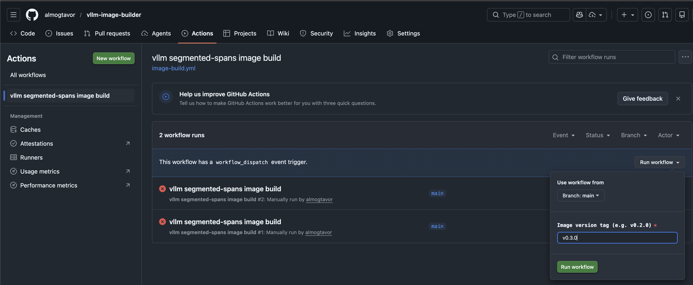

# vllm-image-builder

Build a custom vLLM container image from any vLLM fork/branch. Point it at a repo and branch, and it produces a ready-to-run inference server image with precompiled CUDA kernels - no GPU compilation needed.

## What does the output image contain?

A vLLM inference server exposing the standard OpenAI-compatible API (`vllm.entrypoints.openai.api_server`), built from whichever vLLM fork and branch you configure.

## How the build works

1. Starts from `nvidia/cuda:12.4.1-devel-ubuntu22.04` (same base as vllm-project/vllm's own Dockerfile)
2. Clones the configured vLLM fork and branch
3. Installs PyTorch and vLLM dependencies
4. Installs vLLM with **precompiled CUDA kernels** from `wheels.vllm.ai` for a matching upstream commit - this works when your fork's changes are Python-only (no custom CUDA kernels)
5. GitHub Actions builds and pushes to `ghcr.io/almogtavor/<image-name>`

## Configuration

Edit [`docker/vllm-version`](docker/vllm-version) to set:
- `IMAGE_NAME` - the GHCR package name to publish
- `VLLM_REPO` - the vLLM fork to clone
- `VLLM_BRANCH` - the branch to build
- `VLLM_BASE_COMMIT` - the upstream `vllm-project/vllm` commit your branch is based on (used to fetch matching precompiled CUDA kernels)

## Building locally

```bash
source docker/vllm-version
docker build \
  -f docker/Dockerfile.cuda \
  --build-arg VLLM_REPO=$VLLM_REPO \
  --build-arg VLLM_BRANCH=$VLLM_BRANCH \
  --build-arg VLLM_BASE_COMMIT=$VLLM_BASE_COMMIT \
  -t vllm-custom:local .
```

## Triggering a release build

Use **Actions → workflow_dispatch** with a version tag (e.g. `v0.2.0`), or create a GitHub release.


